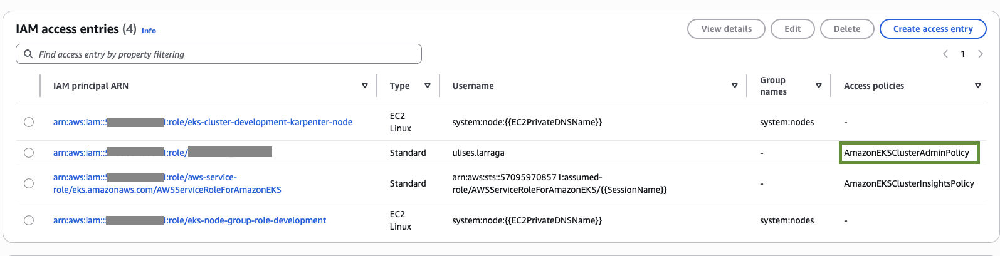

# Build EKS Cluster with Opentofu

## Requirements 
- AWS Account 
- AWS CLI
- 1.8.4 Opentofu
- Helm

## Deploying Network Layer

To deploy an instance of the network and compute resources, follow next steps:

1. First step is to verify which resources will be deployed

```shell
make plan env=development layer=network
```
Behind the scenes, the above command initialize tofu root module, create or select new workspace wit the given env name and runs a tofu plan with a proper terraform.tfvars file.

2. Deploy a new instance of the Network resources

```shell
make apply env=development layer=network
```
The above command will initialize directory if it was not initialized, create or select a workspace with given name and performing a tofu apply with autoapprove flag. 

## Deploying Compute Layer

1. First step is to verify which resources will be deployed

```shell
make plan env=development layer=compute
```

2. Deploy a new instance of the Network resources

```shell
make apply env=development layer=compute
```
If you get an error creating k8s Service accounts repeate step 2

## Configure Auth for cluster
Create kube config file to interact with EKS klsuter through kubectl
```shell
aws eks --region <aws_region> update-kubeconfig --name <cluster_name>
```

Add EKS entry for current user
```shell
aws eks create-access-entry --cluster-name <cluster_name> --principal-arn <principal_arn> --type STANDARD --username ulises.larraga
```

Go to AWS console and navigate to EKS dashboard, select access and select IAM access entries and attach a policy that allows you to perform operations over eks cluster.  



## Other Resources
- [Install AWS Controller](docs/AWS-CONTROLLER.md)
- [Install Argo CD](docs/ARGOCD.md)
- [Install Cluster Autoscaler](docs/AUTOSCALER.md)
- [Configure RDS for K8s example](docs/db-setup.md)
- [Install Karpenter](docs/KARPENTER.md)